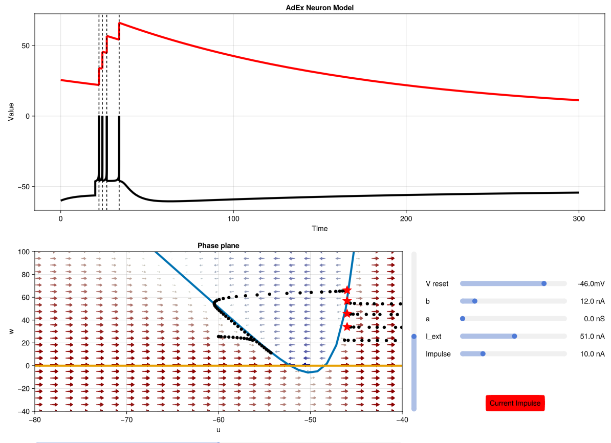

# CompNeuro.jl

A package for teaching Computational Neuroscience.

--------------------------------------------------

The package offers:

- Interactive tools to visualize the solution of 2D differential equations, implementing: FitzHugh Nagumo, Morris Lecar, and AdEx models.


- Visualization of JuliaSNN simulations.


## Installing

To reproduce this project, do the following:

Download this code base via git.  

Open a Julia console and do:

```
julia> using Pkg
julia> Pkg.add("DrWatson") # install globally, for using `quickactivate`
julia> Pkg.activate("path/to/this/project")
julia> Pkg.instantiate()
```

This will install all necessary packages for you to be able to run the scripts, and everything should work out of the box, including correctly finding local paths.

Later, you can close the Julia console and run.

julia Lecture2/FitzHughNagumo.jl
julia Lecture2/MorrisLecar.jl
julia Lecture2/AdEx.jl

It should work out of the box. 

## Changing the script

Students are incouraged to play around with the scripts and adding further parameters to the sliders.
The best is to use Visual Studio Code with the Julia extension installed. 